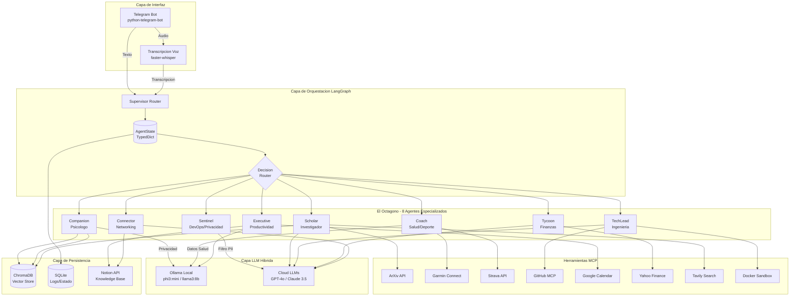
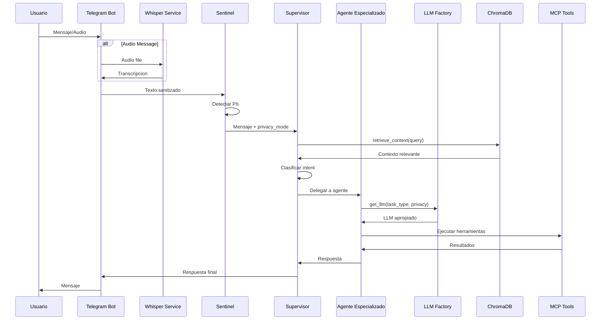
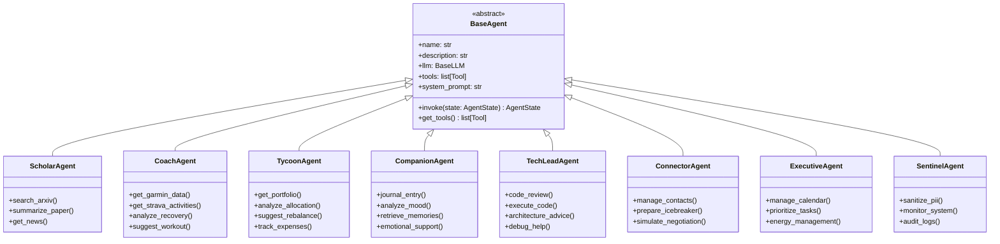
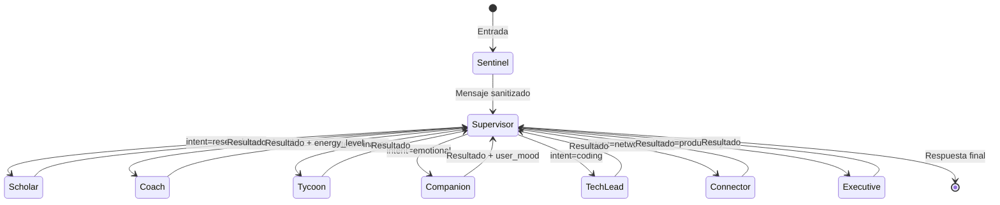
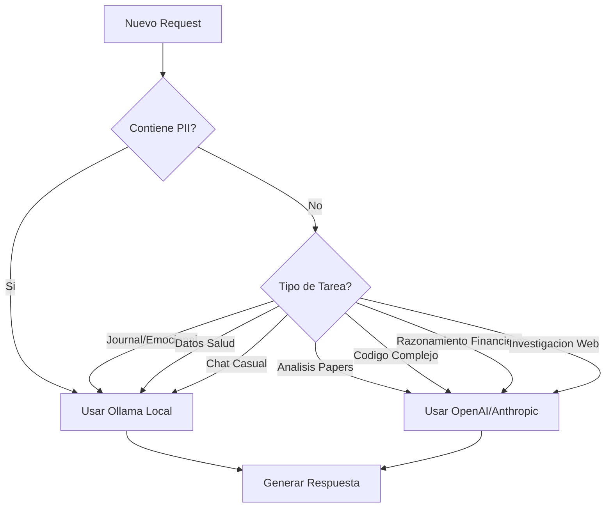

# SPESION - Arquitectura del Sistema Multi-Agente

## Visión General

SPESION es un asistente personal avanzado tipo "Jarvis" diseñado para Eric Gonzalez Duro, 
Ingeniero de Software. Utiliza una arquitectura híbrida con procesamiento local (Ollama) 
para tareas sensibles y cloud (OpenAI/Anthropic) para tareas complejas.

## Diagrama de Arquitectura Principal



## Flujo de Datos Detallado



## Arquitectura de Agentes



## Grafo LangGraph



## Decisión LLM Local vs Cloud



## Estructura de Bases de Datos

### ChromaDB Collections
- `memories`: Memorias a largo plazo del Companion
- `papers`: Resúmenes de papers de ArXiv
- `knowledge`: Notas y conocimiento general
- `conversations`: Historial de conversaciones relevantes

### SQLite Tables
- `conversation_logs`: Historial completo de mensajes
- `agent_metrics`: Métricas de uso por agente
- `transactions`: Logs de operaciones financieras
- `system_events`: Eventos del sistema y errores

## Comandos Telegram

| Comando | Agente | Descripción |
|---------|--------|-------------|
| `/start` | Supervisor | Iniciar conversación |
| `/resumen` | Scholar | Resumen diario de papers/noticias |
| `/entreno` | Coach | Plan de entrenamiento del día |
| `/finance` | Tycoon | Estado del portfolio |
| `/audit` | TechLead | Code review de un repo |
| `/journal` | Companion | Iniciar entrada de diario |
| `/agenda` | Executive | Tareas y calendario del día |
| `/status` | Sentinel | Estado del sistema |

## Variables de Entorno Requeridas

```env
# LLM Configuration
OLLAMA_BASE_URL=http://localhost:11434
OPENAI_API_KEY=sk-...
ANTHROPIC_API_KEY=sk-ant-...

# Telegram
TELEGRAM_BOT_TOKEN=...

# APIs Externas
NOTION_API_KEY=...
GARMIN_EMAIL=...
GARMIN_PASSWORD=...
STRAVA_CLIENT_ID=...
STRAVA_CLIENT_SECRET=...
GITHUB_TOKEN=...
GOOGLE_CALENDAR_CREDENTIALS=...
TAVILY_API_KEY=...

# Storage
CHROMA_PERSIST_DIR=./data/chroma
SQLITE_DB_PATH=./data/spesion.db
```

## Consideraciones de Hardware

- **CPU**: Intel i5-8259U (4 cores, 8 threads)
- **RAM**: 16GB
- **GPU**: Integrada (Intel Iris Plus 655)

### Optimizaciones:
1. Usar modelos cuantizados para Ollama (phi3:mini, llama3:8b-q4)
2. Limitar contexto de ChromaDB a 5 documentos por query
3. Batch processing para tareas no urgentes
4. Caché de respuestas frecuentes en SQLite

